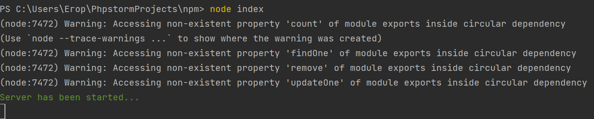
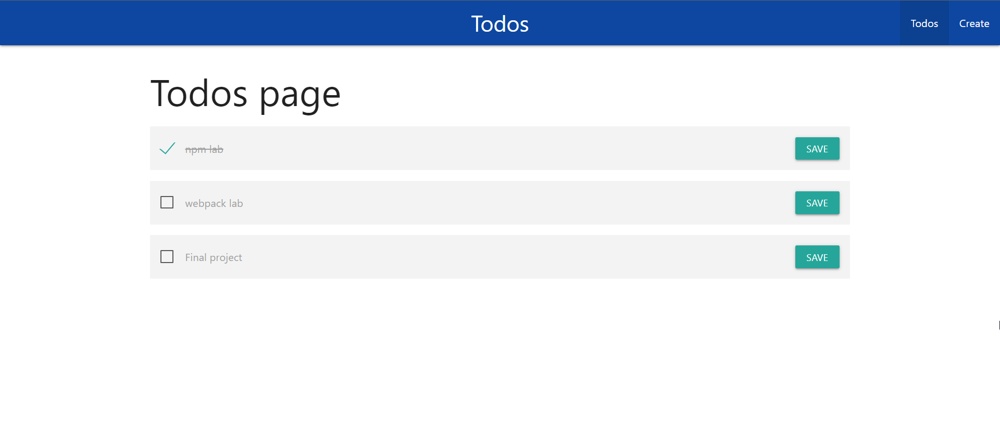
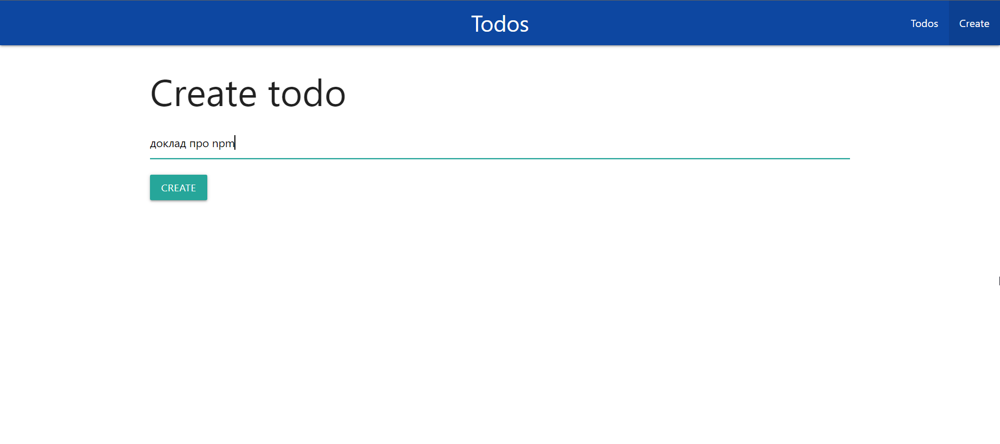
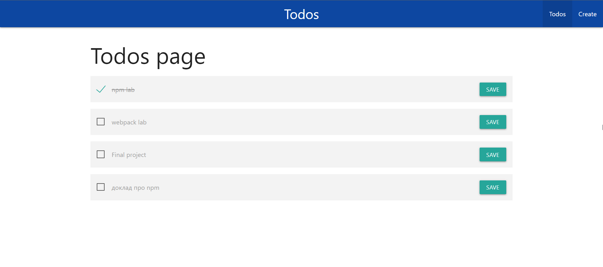
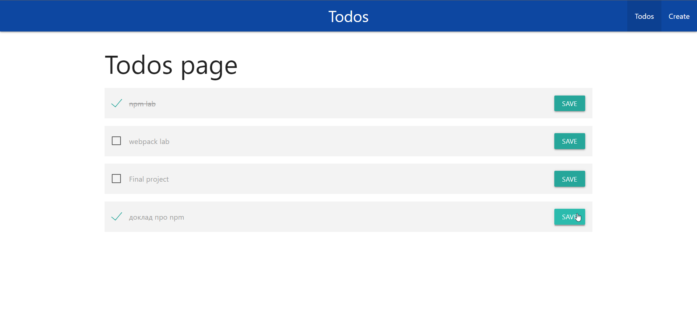

# npm lab
# Про проект и скрин запуска
В данной лабораторной использовались такие пакеты, 
как **chalk**, **express**, **express-handlebars**, 
**mongoose**. Причём версии express и express-handlebars
намерено взяты старые, потому что в новых версиях были проблемы 
с доступом к некоторым атрибутам((

Также использовался **nodemon** для автоматического 
перезапуска приложения при разработке
(то есть только для разработчика)

Чтобы запустить проект у себя, необходимо иметь БД
на mongodb и создать файлик config.js, по типу такого:

```js
let config = {};

config.name = 'ваше имя'
config.password = 'ваш пароль'

module.exports = config;
```
и поменять в @cluster0.ikq2a.mongodb.net строчку ikq2a в файле index.js
на свою из mongodb.
И так же требуется установить все пакетики:```npm i```
### Скриншот запуска проекта через node:



## Демонстрация работы сайта
Главная страничка сайта. На данный момент в БД 3 записи.

Переходим на Create и попытаемся внести новую задачу.

Нас перебрасывает на главную, где уже есть эта запись

Отметим галочкой

Нажмём save
